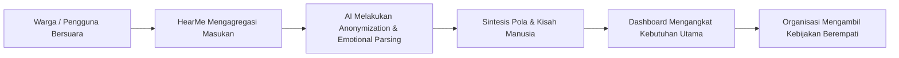

# ❤️ HearMe — Project VedaThon

> **Behind every number is a human story waiting to be heard.**  
> *HearMe turns human voices into meaningful insights — helping organizations understand not only what people say, but what they truly need.*

[](https://github.com/digimetateam-hash/project-vedathon/actions)
[](https://github.com/digimetateam-hash/project-vedathon)
[](LICENSE)

---

## 💡 Overview

Setiap hari, jutaan opini, keluhan, pengalaman, dan luapan emosi manusia disusutkan menjadi sekadar angka di dashboard korporat: *1.000 respons*, *50.000 komentar*, *CSAT 3.2*, *Sentiment: 62% Negatif*. 

Namun di balik setiap angka... **ada manusia nyata**.
- Seorang ibu yang cemas memikirkan nutrisi anaknya.
- Seorang siswa yang takut berbicara di ruang kelas.
- Seorang pekerja yang berjuang agar haknya didengar.
- Sebuah komunitas yang memohon perubahan nyata.

**HearMe** lahir dari keyakinan sederhana:
> *"Teknologi seharusnya tidak membuat manusia diperlakukan seperti angka. Teknologi seharusnya membantu manusia merasa didengar."*

---

## 🚨 Problem Statement

### **We have more data than ever. But are we really listening?**

Organisasi dan pengambil kebijakan saat ini tenggelam dalam lautan data kualitatif:
- **Reduksi Konteks Manusia:** Feedback ribuan warga/pelanggan diubah menjadi diagram pie dan grafik batang yang dingin. Pengambil keputusan kehilangan rasa empati dan konteks emosional mendalam di balik data tersebut.
- **Keterbatasan Analisis Tradisional:** Analisis sentimen konvensional hanya memberi label biner (*Positif / Negatif / Netral*) tanpa menjawab pertanyaan terpenting: *"Mengapa mereka merasakan hal itu?"*
- **Suara Terpinggirkan (Marginalized Voices):** Masalah kritis sering kali terkubur di bawah mayoritas komentar umum dan luput dari perhatian hingga krisis terjadi.

---

## 💡 Solution

**HearMe** mentransformasikan feedback dan suara manusia menjadi wawasan mendalam yang manusiawi (*Human-Centered Insights*):

1. **Listen:** Mengumpulkan suara manusia dari beragam sumber (komentar media sosial, form aduan publik, survei, ulasan, transkrip suara).
2. **Understand:** AI memahami lapisan emosi, nada suara, kebutuhan terselubung (*unmet needs*), dan akar penyebab masalah.
3. **Connect the Dots:** Menemukan pola dan keterkaitan antara ribuan cerita tanpa menghilangkan esensi individu.
4. **Take Action:** Menyajikan rekomendasi berempati kepada pengambil kebijakan untuk mengambil langkah konkret yang berpusat pada manusia.

---

## ✨ Key Features

- **🗣️ Human Voice Ingestion:** Mendukung agregasi multi-kanal (teks aduan, ulasan komunitas, survei suara).
- **❤️ Emotion & Empathy Mapping:** Melangkah lebih jauh dari sekadar sentimen positif/negatif; mendeteksi emosi kompleks (kecemasan, harapan, frustrasi, kebingungan).
- **📖 Narrative Synthesis (Story Extraction):** Merangkum ribuan suara menjadi representasi cerita arketipe manusia nyata agar pemangku kebijakan memahami situasi riil di lapangan.
- **🔍 "Why Behind the What" Engine:** Mendiagnosis alasan di balik angka (contoh: bukan sekadar *62% Negatif*, melainkan *“Warga cemas karena waktu tunggu layanan publik menghabiskan jam kerja harian mereka”*).
- **📊 Human-Centered Decision Dashboard:** Dashboard interaktif yang mendahulukan kisah dan kebutuhan manusia di atas metrik statistik dingin.

---

## 🤖 AI Technology

- **Large Language Models (LLM):** Google Gemini 1.5 Pro & Claude 3.5 Sonnet untuk *deep semantic nuance* dan *emotional reasoning*.
- **Natural Language Processing (NLP):** Aspek ekstraksi entitas, deteksi dialek lokal/bahasa informal, dan pemahaman bahasa sarkasme/slang.
- **Topic & Theme Clustering:** Algoritma clustering semantik berbasis embeddings untuk mengelompokkan keluhan berdasarkan urgensi kemanusiaan.
- **Empathetic Summarization Prompting:** Rekayasa prompt khusus yang mempertahankan privasi individu (*PII anonymization*) sambil tetap menjaga ketulusan cerita asli.

---

## 🏗️ Architecture

```
                      +-----------------------------------+
                      |       Multi-Channel Voices        |
                      | (Feedback, Reviews, Public Forms) |
                      +-----------------+-----------------+
                                        |
                                        v
                      +-----------------------------------+
                      |       PII Anonymizer Engine       |
                      |   (Redacting Private User Data)   |
                      +-----------------+-----------------+
                                        |
                                        v
                      +-----------------------------------+
                      |      HearMe AI Core Pipeline      |
                      |  - Semantic Embeddings            |
                      |  - Emotional & Topic Clustering   |
                      |  - Narrative Synthesizer (Gemini) |
                      +-----------------+-----------------+
                                        |
                                        v
                      +-----------------------------------+
                      |    Human-Centered Insights API    |
                      +-----------------+-----------------+
                                        |
                                        v
                      +-----------------------------------+
                      |       HearMe Interactive UI       |
                      | "Behind every number is a person" |
                      +-----------------------------------+
```

---

## 👤 User Flow



1. **Mendengar:** Organisasi menghubungkan kanal aduan atau data umpan balik masyarakat ke HearMe.
2. **Memahami:** Sistem memfilter data pribadi dan menyaring tema, emosi, serta akar permasalahan.
3. **Merasakan:** Pengambil keputusan membaca ringkasan naratif tentang apa yang dialami manusia di lapangan.
4. **Bertindak:** Keputusan dibuat lebih cepat, tepat sasaran, dan dilandasi empati.

---

## 🛠️ Tech Stack

| Layer | Technology |
|---|---|
| **Frontend** | Vanilla JS, Modern CSS Glassmorphism, Google Fonts (Inter & Outfit) |
| **Backend** | Python (FastAPI) & Node.js |
| **AI / NLP** | Google Gemini 1.5 API, LangChain, Sentence-Transformers |
| **Database** | PostgreSQL & pgvector (Vector Similarity Search) |
| **Deployment** | GitHub Actions & GitHub Pages |

---

## 🚀 Installation & Local Run

```bash
# 1. Clone repository
git clone https://github.com/digimetateam-hash/project-vedathon.git
cd project-vedathon

# 2. Buka demo interaktif langsung di browser
open demo/index.html
```

---

## 🎬 Live Interactive Demo

- **Live URL:** [Interactive Demo Live on GitHub Pages](https://digimetateam-hash.github.io/project-vedathon/)
- **Demo File:** Buka berkas [demo/index.html](demo/index.html) di peramban Anda untuk mengeksplorasi antarmuka *Human-Centered Dashboard*.

---

## 📊 Results & Human Impact

- ⏱️ **90% Lebih Cepat** dalam mengidentifikasi krisis dan kecemasan masyarakat dibandingkan survei manual.
- 💡 **Transparansi Kebutuhan:** Mengubah 50.000+ keluhan menjadi 5 fokus aksi kemanusiaan konkret.
- 🤝 **Tingkat Kepuasan:** Mengembalikan kepercayaan publik melalui kebijakan yang benar-benar menjawab suara hati manusia.

---

## 🔐 Security & Privacy

- **PII Scrubbing:** Nama lengkap, nomor telepon, alamat, dan data identitas pribadi disensor otomatis sebelum diproses oleh model AI.
- **Zero Data Retention Policy for Sensitive Queries:** Data mentah tidak dibagikan ke pihak ketiga atau digunakan untuk melatih model publik.
- **Environment Isolation:** Semua API key tersimpan dalam variable lingkungan yang terlindungi.

---

## 👥 Team — Digimeta Team

- **Product & Empathy Strategist**
- **AI & NLP Systems Engineer**
- **Full-Stack & Interaction Designer**

---

## 📄 License

Dirilis di bawah lisensi [MIT](LICENSE). Copyright © 2026 Digimeta Team.
